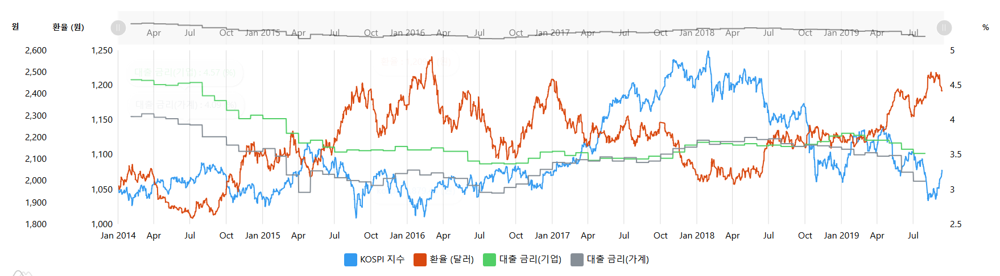

# 금융데이터 분석, 트렌딩

## 목표

우리 나라의 경제에 한해, 

- 코스피 지수가 상승할 때 환율은 하락하는지, 금리가 상승의 동기를 부여하는지, 
- 국제 금값의 시세는 금값이 오르고 나서 은값이 상승의 기미를 보이며 금값보다 더 높게 상승하는지 
- 비트코인의 최근 4년간 최고점과 최저점은 어디인지
- 코스피의 최근 5년간 최고점과 최저점은 어디인지
- 정권 교체 2년 전 후마다의 차트를 한 페이지에 놓아 비교하는 등

의 프로젝트를 진행해보고자 한다.   

기술을 배워서 이롭게 쓰고자 하는 마음에 시작하게 되어싿.

## TODO

**Season 1**

- 
- API) TDD + api 화 하기
- 인증) JWT 인증 구현 (Slack)
    
- AWS 배포
- Zenkins + AWS 배포 자동화
- 이슈관리 시스템 도입 필요
- 각각의 페이지에 대한 기획점 분류
  (지표 모아보기- trending all, 상관분석, 정권교체기마다의 흐름, 미국 대선 전후 마다의 흐름 등)

**Season 2**

- React 도입!! 후하하하. web(Express.js)과 api(Spring Boot) 분리
- TDD기반 개발 진행
- 상관분석 (각각의 지표가 다른 지표와 1인지 -1인지)
- Docker - 크롤링코드, python,java,spring 개발/배포 환경 

**Season3**

- api 서버 다중화 (기획점에 따라 크게 분류를 나누아 각각에 대한 api 서버로 분리)
- 다중화된 api 서버에 대한 인증 서버 구현

## ScreenShots

2019-09-17 (현재)

- 금/은 (영국 거래소), 코스닥 지표 필요
- 주요지표에(코스피, 금) 따르는 부수지표들(코스닥, 은) 분류

