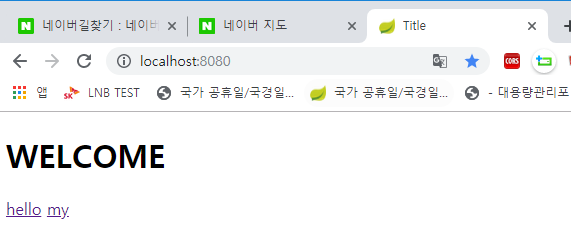
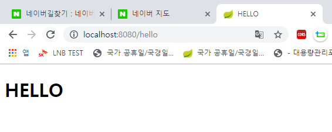
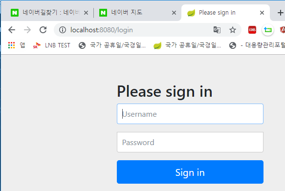
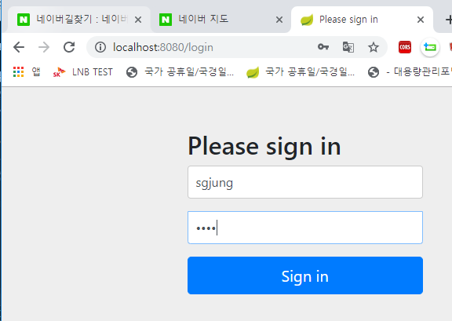
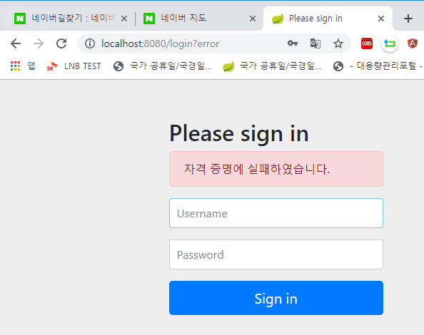

# 강의 노트

## 시큐리티 2부)

스프링 부트가 제공하는 기본 시큐리티 설정은 

- Security 설정, 
  폼인증, 베이직 authentication을 활성화 시켜주고 모든 요청에 authentication이 필요하다고 정의해준 것은 스프링 부트가 자동으로 시큐리티를 자동으로 설정해준 것들이다.(SpringBootSecurityAutoConfiguration)
- UserDetails설정 
  기본으로 랜덤 패스워드를 만들어주는 UserDetailsAutoConfiguration

이렇게 두가지이다.  

  

여기서 정리하려고 하는 시큐리티의 개념은 아래의 3가지이다.

- Security 설정 (WebSecurityConfigurerAdapter)
- UserDetailsService 설정
- PasswordEncoder 설정

  

### 예제 목표

hello 페이지에는 인증받지 않은 어떤 사용자도 접근할 수 있고  

my페이지에는 인증받은 사용자만 접근할 수 있도록 하는 것이 목표이다.  

  

### Security 설정

이전예제에서 만든 프로젝트에서 WebSecurityConfig.java를 아래와 같이 수정한다.  

##### WebSecurityConfig.java

```java
package com.scrapper.security1.config;

import org.springframework.context.annotation.Configuration;
import org.springframework.security.config.annotation.web.builders.HttpSecurity;
import org.springframework.security.config.annotation.web.configuration.WebSecurityConfigurerAdapter;

/**
 * 커스텀 스프링 부트 시큐리티 설정
 *   : WebSecurityConfigurerAdapter를 extends한 클래스를 선언해 @Configuration으로 등록한 후
 *     아무것도 하지 않을 경우는 기본 인증이 적용된다.
 *     기본 인증이 적용될때 디폴트로 WebSecurityConfigurerAdapter 내에서 수행하는
 *     기본 랜덤 패스워드/계정을 인메모리로 생성해낸다.
 *          ex)
 *          Using generated security password: 73e78e22-300f-4a18-93c3-a34f36adf624
 */
@Configuration
public class WebSecurityConfig extends WebSecurityConfigurerAdapter {

    @Override
    protected void configure(HttpSecurity http) throws Exception {
//        super.configure(http);
        http.authorizeRequests()
                .antMatchers("/", "/hello").permitAll() // / 와 hello에 해당하는 페이지는 모든 사용자가 볼수 있도록 허용
                .anyRequest().authenticated()    // 그 외의 모든 요청은 authentication이 필요하다.
            .and()
                .formLogin()        // 그리고 form 로그인을 사용할 것이고
            .and()
                .httpBasic();       // httpBasic 인증도 사용할 것이다.
    }
}

```


- 요청 URL이 '/' 와 '/hello' 가 아니고 Accept-Header가 html이 아닐 경우 Form Login에 걸리게 된다.
- Accept-Header에 html이 없는 경우 HttpBasic에 걸리게 된다.

  

여기까지의 결과화면은 

인증되지 않은 사용자가 "/" 또는 "/hello" 외의 모든 URL에 대해서 아래의 페이지를 볼 수 있다.



인증되지 않은 사용자도 "/hello" 페이지를 요청했을 때 아래와 같이 페이지를 볼수 있다.



로그인을 하지 않았을때 그 외의 모든 경우는 아래와 같은 화면을 확인할 수 있다.



로그인을 시도해보자



아직까지는 user 정보를 추가하고, UserDetailsService와 연동하지 않았기 때문에 로그인에 실패한다.



  

지금까지는 AutoConfiguration을 overriding 해서 기본 설정을 커스터마이징 했다.

이제 유저 정보를 Security와 연동하는 과정(UserDetailsService의 활용)을 알아본다.  


### UserDetailsService 의 활용

위에서는 기본 html Accept Header에 대해 허용할 URL과 인증(login)을 거쳐야만 하는 페이지들에 대한 처리를 끝냈다. 여기서는 **인증시 DB와 Security를 연동하는 과정**을 정리한다.

  

먼저 pom.xml에 아래와 같이 의존성을 추가해주자.

```xml
        <dependency>
            <groupId>org.springframework.boot</groupId>
            <artifactId>spring-boot-starter-data-jpa</artifactId>
        </dependency>

        <dependency>
            <groupId>com.h2database</groupId>
            <artifactId>h2</artifactId>
        </dependency>
```

이 예제에서는 jpa로 데이터 연동로직(DAO)을 작성하고, Database로는 h2database를 사용할 것이다.  

  

#### UserAuthVO 

User에 대한 정보를 DB에서 가지고 올 때 서버의 인메모리에서 들고 있어야 하는 정보들을 담기 위한 클래스이다.

```java
package com.scrapper.security1.vo;

import javax.persistence.Entity;
import javax.persistence.GeneratedValue;
import javax.persistence.Id;

@Entity
public class UserAuthVo {

    @Id @GeneratedValue
    private Long id;
    private String username;
    private String password;

    public Long getId() {
        return id;
    }

    public void setId(Long id) {
        this.id = id;
    }

    public String getUsername() {
        return username;
    }

    public void setUsername(String username) {
        this.username = username;
    }

    public String getPassword() {
        return password;
    }

    public void setPassword(String password) {
        this.password = password;
    }
}
```

  

#### UserAuthService.java

통상적으로 아무것도 준비되지 않은 어플리케이션에서 무언가 인증을 위한 기본적인 기능을 작성하고자 할때 가장 많이 작성되는 로직은

- createUserAuthVo(String userName, String password)
  user를 java내에서 임의로 만들어서 테스트 해보기 위함.
- loadUserByUserName()
  시큐리티의 인증기능과 DB정보를 연동할 때 사용
- java 단에서의 테스트를 위한 유저 생성

이다.

##### 1) createUserAuthVo(String username, String password)

createUserAuthVo(String, String) 함수를 만들어보자. createUserAuthVo(String, String) 함수의 역할은 아래와 같다. 외부(jsp / 사용자 입력 등)로부터의 username, password 정보를 전달받아 이에 대한 

- UserAuthVo 객체를 생성하고
- 이 객체로 이 객체에 대한 JpaRepository의 save 함수를 타도록 한다.

  

**UserAuthService.java**

```java
package com.scrapper.security1.service;

import com.scrapper.security1.dao.UserAuthRepository;
import com.scrapper.security1.vo.UserAuthVo;
import org.springframework.beans.factory.annotation.Autowired;
import org.springframework.stereotype.Service;

@Service
public class UserAuthService {

    @Autowired
    private UserAuthRepository userAuthRepository;

    public UserAuthVo createUserAuthVo(String username, String password){
        UserAuthVo userAuthVo = new UserAuthVo();
        userAuthVo.setUsername(username);
        userAuthVo.setPassword(password);
        return userAuthRepository.save(userAuthVo);
    }
}
```

  

##### 2) loadUserByUsername(String username) 

스프링 시큐리티에서 제공하는 UserDetailsService 인터페이스를 implements 하고 그 중 

- loadUserByUsername(String username)

메서드를 오버라이딩 한다.


**UserAuthService.java** 

```java
/**
 * 1. DAO로 user 검색
 * 2. User 객체 생성 및 권한 생성
 * @param username
 * @return
 * @throws UsernameNotFoundException
 */
@Override
public UserDetails loadUserByUsername(String username) throws UsernameNotFoundException {
    Optional<UserAuthVo> foundUser = userAuthRepository.findByUsername(username);
    UserAuthVo userAuthVo = foundUser.orElseThrow(() -> new UsernameNotFoundException(username));

    // return 타입인 UserDetails는 User정보 (UserAuthVo, Account 등등 프로그래머에 의해 만들어진 인증 Vo)에 대한 interface이다.
    // authorities 메서드에서 리턴하는 Collection<? extends GrantedAuthorty>를 User 생성자의 인자로 주어
    // 시큐리티에서 제공하는 인증이 부여된 사용자를 만들어낼 수 있다.
    return new User(userAuthVo.getUsername(), userAuthVo.getPassword(), authorities());

}

/**
 * 간단한 인증 권한 부여 함수 :
 *      "ROLE_USER" 라는 권한을 가진 USER라는 정보를 세팅해서
 *      GrantedAuthority 타입의 컬렉션으로 리턴해주는 함수
 * @return
 */
private Collection<? extends GrantedAuthority> authorities() {
    return Arrays.asList(new SimpleGrantedAuthority("ROLE_USER"));
}
```


**UserAuthRepository.java**

```java
package com.scrapper.security1.dao;

import com.scrapper.security1.vo.UserAuthVo;
import org.springframework.data.jpa.repository.JpaRepository;

import java.util.Optional;

public interface UserAuthRepository extends JpaRepository<UserAuthVo, Long>{
    Optional<UserAuthVo> findByUsername(String username);
}
```


##### 꿀팁

alt + enter로... 캡처한 내용들 적자  

  

##### java 단에서의 테스트를 위한 유저 생성

@PostConstruct 어노테이션으로 조금 더 쉽게 테스트를 해볼 수는 있다. 하지만 여기서는 일단 ApplicationRunner 클래스를 작성해 테스트해보기로 한다. ApplicationRunner의 사용법을 숙지하려는 목적도 있고해서.  

  

**UserAuthRunner.java**

```java
package com.scrapper.security1.config;

import com.scrapper.security1.service.UserAuthService;
import com.scrapper.security1.vo.UserAuthVo;
import org.springframework.beans.factory.annotation.Autowired;
import org.springframework.boot.ApplicationArguments;
import org.springframework.boot.ApplicationRunner;

public class UserAuthRunner implements ApplicationRunner {

    @Autowired
    UserAuthService userAuthService;

    @Override
    public void run(ApplicationArguments args) throws Exception {
        UserAuthVo userAuthVo = userAuthService.createUserAuthVo("scrapper", "1111");
        System.out.println(userAuthVo.getUsername() + "password : " + userAuthVo.getPassword());
    }
}
```


여기까지의 실행결과는 정상적이지만 로그인하려고 할때 에러를 낸다.

이유는 Password를 Encoding하지 않았기 때문이다.  

  

### PasswordEncoder 설정

패스워드 인코딩을 테스트를 위해 NoopEncoder를 사용할 수 도 있지만 권장하지 않는 방법이고 보통은 PasswordEncoder를 사용한다고 한다. 이에 대한 코드는 매우 간단하다. 

- Config 에 PasswordEncoder 의 인스턴스를 리턴하는 빈 작성
- UserAuthService.java 내에서 PasswordEncoder를 Autowired 
- Autowired된 PasswordEncoder로 password를 encode(String)

  

아래의 코드를 보자.  

**WebSecurityConfig.java**

```java
package com.scrapper.security1.config;

import org.springframework.context.annotation.Bean;
import org.springframework.context.annotation.Configuration;
import org.springframework.security.config.annotation.web.builders.HttpSecurity;
import org.springframework.security.config.annotation.web.configuration.WebSecurityConfigurerAdapter;
import org.springframework.security.crypto.factory.PasswordEncoderFactories;
import org.springframework.security.crypto.password.PasswordEncoder;

/**
 * 커스텀 스프링 부트 시큐리티 설정
 *   : WebSecurityConfigurerAdapter를 extends한 클래스를 선언해 @Configuration으로 등록한 후
 *     아무것도 하지 않을 경우는 기본 인증이 적용된다.
 *     기본 인증이 적용될때 디폴트로 WebSecurityConfigurerAdapter 내에서 수행하는
 *     기본 랜덤 패스워드/계정을 인메모리로 생성해낸다.
 *          ex)
 *          Using generated security password: 73e78e22-300f-4a18-93c3-a34f36adf624
 */
@Configuration
public class WebSecurityConfig extends WebSecurityConfigurerAdapter {

    @Override
    protected void configure(HttpSecurity http) throws Exception {
//        super.configure(http);
        http.authorizeRequests()
                .antMatchers("/", "/hello").permitAll() // / 와 hello에 해당하는 페이지는 모든 사용자가 볼수 있도록 허용
                .anyRequest().authenticated()    // 그 외의 모든 요청은 authentication이 필요하다.
            .and()
                .formLogin()        // 그리고 form 로그인을 사용할 것이고
            .and()
                .httpBasic();       // httpBasic 인증도 사용할 것이다.
    }

    @Bean
    public PasswordEncoder passwordEncoder(){
        return PasswordEncoderFactories.createDelegatingPasswordEncoder();
    }
}
```


**UserAuthService에 암호화(Encoding) 적용하기**

```java
@Autowired
private PasswordEncoder encoder;
```
PasswordEncoder 타입의 객체를 Autowired 받았다.

  

```java
public UserAuthVo createUserAuthVo(String username, String password){
    UserAuthVo userAuthVo = new UserAuthVo();
    userAuthVo.setUsername(username);
    userAuthVo.setPassword(encoder.encode(password));
    return userAuthRepository.save(userAuthVo);
}
```
UserAuthVo객체를 생성해내는 부분에서 password를 Encoding해서 저장하고 있다.

  

**UserAuthService.java**

```java
package com.scrapper.security1.service;

import com.scrapper.security1.dao.UserAuthRepository;
import com.scrapper.security1.vo.UserAuthVo;
import org.springframework.beans.factory.annotation.Autowired;
import org.springframework.security.core.GrantedAuthority;
import org.springframework.security.core.authority.SimpleGrantedAuthority;
import org.springframework.security.core.userdetails.User;
import org.springframework.security.core.userdetails.UserDetails;
import org.springframework.security.core.userdetails.UserDetailsService;
import org.springframework.security.core.userdetails.UsernameNotFoundException;
import org.springframework.security.crypto.password.PasswordEncoder;
import org.springframework.stereotype.Service;

import java.util.Arrays;
import java.util.Collection;
import java.util.Optional;

@Service
public class UserAuthService implements UserDetailsService {

    @Autowired
    private UserAuthRepository userAuthRepository;

    @Autowired
    private PasswordEncoder encoder;

    public UserAuthVo createUserAuthVo(String username, String password){
        UserAuthVo userAuthVo = new UserAuthVo();
        userAuthVo.setUsername(username);
        userAuthVo.setPassword(encoder.encode(password));
        return userAuthRepository.save(userAuthVo);
    }

    /**
     * 1. DAO로 user 검색
     * 2. User 객체 생성 및 권한 생성
     * @param username
     * @return
     * @throws UsernameNotFoundException
     */
    @Override
    public UserDetails loadUserByUsername(String username) throws UsernameNotFoundException {
        Optional<UserAuthVo> foundUser = userAuthRepository.findByUsername(username);
        UserAuthVo userAuthVo = foundUser.orElseThrow(() -> new UsernameNotFoundException(username));

        // return 타입인 UserDetails는 User정보 (UserAuthVo, Account 등등 프로그래머에 의해 만들어진 인증 Vo)에 대한 interface이다.
        // authorities 메서드에서 리턴하는 Collection<? extends GrantedAuthorty>를 User 생성자의 인자로 주어
        // 시큐리티에서 제공하는 인증이 부여된 사용자를 만들어낼 수 있다.
        return new User(userAuthVo.getUsername(), userAuthVo.getPassword(), authorities());

    }

    /**
     * 간단한 인증 권한 부여 함수 :
     *      "ROLE_USER" 라는 권한을 가진 USER라는 정보를 세팅해서
     *      GrantedAuthority 타입의 컬렉션으로 리턴해주는 함수
     * @return
     */
    private Collection<? extends GrantedAuthority> authorities() {
        return Arrays.asList(new SimpleGrantedAuthority("ROLE_USER"));
    }
}
```


### 마치면서

위에서 살펴본 설정은 매우 기본적인 설정이다. 여기서 더 나아가면 

- configure 메서드로 요청이 오기 전에 어떤 요청들을 시큐리티로 처리할지 걸러낼수도 있고
- configure 메서드 내에서 csrf 설정을 하거나 다양한 oauth등의 방식을 사용할 수도 있다.
- User 정보를 생성할 때 컨트롤러나 폼에서 , rest api 에서 입력받은 값을 사용해서 User정보를 만들도록 하는 코딩
- 폼 인증 화면도 커스터마이징 해서 만드는 경우 또한 존재한다.


