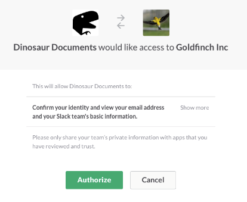
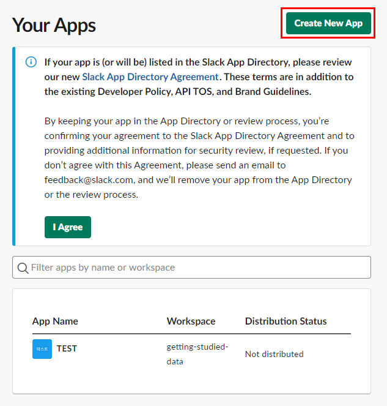
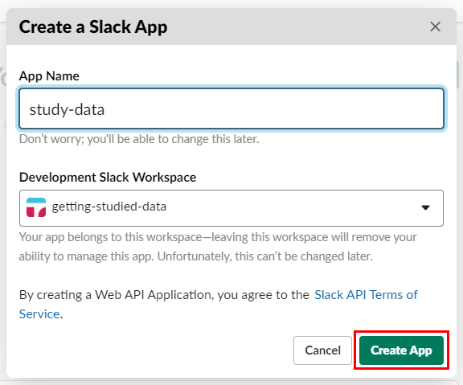
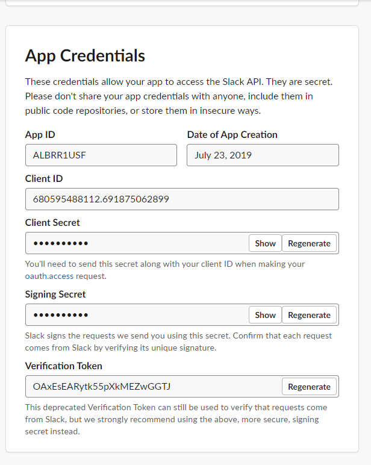
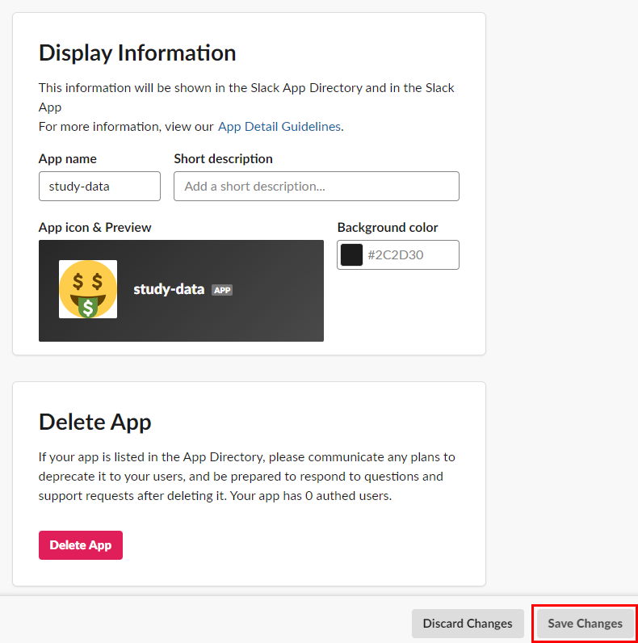
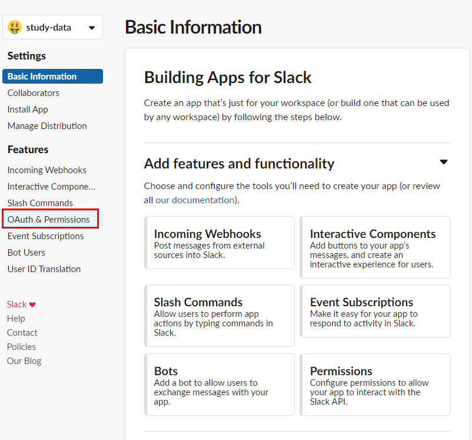
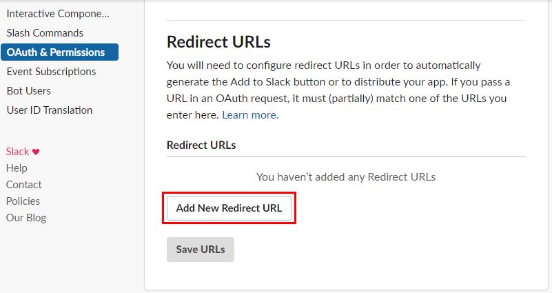
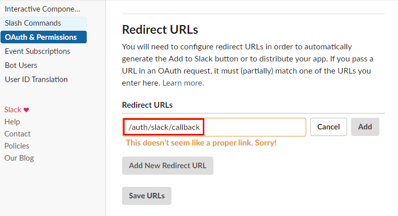
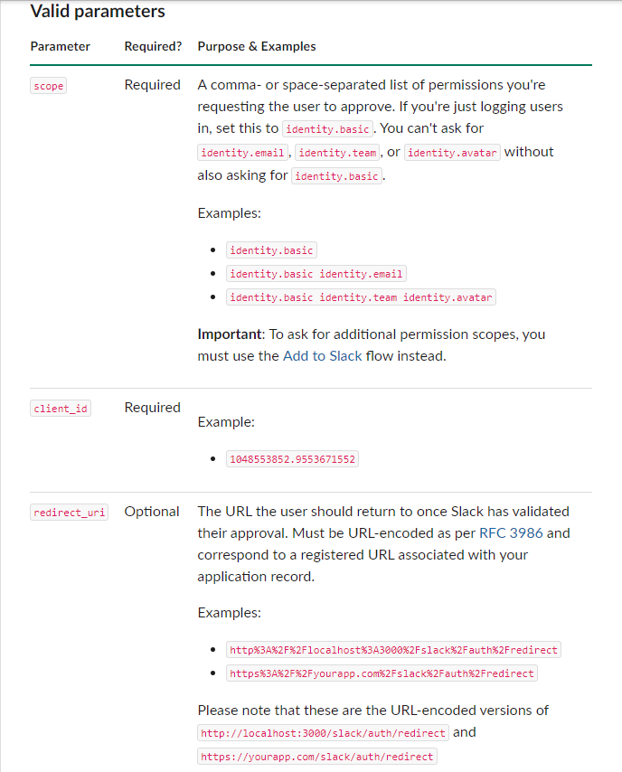
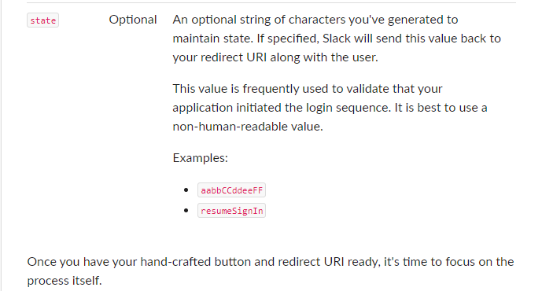

# Sign in With Slack
https://api.slack.com/docs/sign-in-with-slack  
사용자가 로그인하는 것은 조금의 HTTP Request를 보내는 것으로 가능하다.  

- Set up your Slack App  
https://api.slack.com/docs/sign-in-with-slack#create_slack_app  

- Add your Sign in with Slack button
https://api.slack.com/docs/sign-in-with-slack#button_setup  

- Handle the authorization flow  
https://api.slack.com/docs/sign-in-with-slack#authorization  

- Use tokens to retrieve user and workspace information
https://api.slack.com/docs/sign-in-with-slack#request_info  



## Identify users and their workspace
**identity** permission scope 와 users.identity 는 멤버들이 signing in 하는지 idendtify 하는 것을 빠르게 할수 있도록 해준다.

## Everybody can sign in except when they can't
오직 scope 들의 identity family 들을 요청하는 Slack App들은 integration들의 맥시멈 넘버들에 관여하지 않는다.  
  
## Sign in again and again
Sign in Slack은 로그인에 특화 되어 있다. user들을 리턴하는 것은 불필요한 승인과정들에 방해받지 않는다.  
   
## Already built a Slack app ?
5분만 할애해서 Sign in with Slack 버튼을 셋업하시라. 이 것은 **Add to Slack**버튼을 보완한다.  
그리고 당신은 항상 부가적인 permission을 요구할 수도 있다.  

## Implementation Overview
OAuth 2.0을 해보는게 처음이라면 Sign in with Slack은 이해하기 쉬울 것이다.  
이미 해본 사람이라면, 쉬울거다 이런 말을 한다. 이런... 너무 한 챕터를 날려 드시는구먼 ㅋㅋㅋ   
  

  
크게 세 흐름으로 나누어 요약 정리해보면 아래와 같다.
1. 사용자가 Slack에 로그인 요청을 하는 것은 User라는 자원(DB 리소스 등)을 요청하고 승인받는다. 
  즉 Resource Owner에게 인증 요청해 Grant(승인)를 받는다.  
  
2. 1에서 받은 Grant를 가지고 Service API에서 Access Token을 받는다.  
  즉 Authorization Server에 grant로 요청하여 Access Token을 얻어낸다.    
  
3. 2에서 받은 Access Token을 기반으로 Protected Resource를 얻어낸다.  
  즉 Resource Server에서 Access Token으로 Protected Resource를 얻어낸다.     
  
  
## Token negotiation flow  
1. 사용자가 site에 도착해 Sign in with Slack 버튼을 클릭  
2. 사용자가 slack.com/oauth/authorize?client_id=CLIENT_ID&scope=identity.basic 에 도착한다.  
   (버튼을 눌렀으니깐...) 그리고 간결하게 sign in 을 승인한다.  
3. 사용자가 파라미터 **'code'**와 함께 특정 URL로 리다이렉트 된다.  
   여기서 특정 URL이라는 것은 프로그래머가 request에 미리 정의 해놓은 url이다.    
4. slack.com/api/oauth.access 를 이용해 우리가 만든 서버는 access token에 대한 파라미터 code 를 교환한다.    
5. 우리가 만든 서버는 그 결과로 생긴 access token을 user를 request하는데 사용하기도 하고 workspace detail을 request 하는데에도 사용한다.  
   request 를 보낼때는 slack.com/api/users.identify?token=awared_token 으로 보낸다.  
  
사용자가 첫 로그인을 할때 슬랙은 app을 승인할지를 물어본다. 그리고 기본 workspace 정보를 물어본다.  
이후 이런 승인된 것들에 대한 정보를 슬랙에서 redirect URL 과 함께 보내준다.


가이드 문서에서 create app 링크를 타고 들어간 부분  
https://api.slack.com/apps/ALBRR1USF?created=1    
  
  

  

  

  

  

  

  

  

## Waht's a redirect URL?
Redirect URLs는 authentication 절차에서 중요한 부분을 처리하는 어플리케이션 또는 우리의 사이트의 특정 URL이다.  
어플리케이션의 record의 한 부분으로 redirect URLs를 등록함으로써 authorization codes를 전송하기 위해 당신(이 글을 읽고 있는 나)는 Slack에게 유효한 주소를 지시하는 것이 된다.  
  
개발을 진행하면서 당신은 redirect들을 localhost에 등록할 수 있다. 하지만 우리는 SSL이 지원되는 퍼블릭으로 가능한 서버를 사용하는 것을 권장한다. 
  
## Set up your Sign in with Slack Button
여기서부터는 뜬구름 잡는 얘기나 지들 회사(Slack) 자랑이나 PR이 적고 본격적으로 파라미터 등에 대한 이야기를 한다.  
slack 버튼은 아래와 같이 생겼다. 가장 기본적인 파라미터의 형태이다.    
```html
<a href="https://slack.com/oauth/authorize?scope=identity.basic&client_id=your_client_id">
    
</a>
```  
scope 파라미터에는 보통 identity.basic과 지정한다고 한다(잠재적으로 관련된 scope들에 대해서는 곧 다룬다.). 그리고 scope와 함께 client_id를 함게 파라미터로 포함한다. 
  
## Valid Parameters (파라미터 명세)
- scope  
- client_id  
- redirect_uri  
- state  

공식 홈페이지 설명

  


