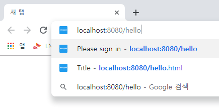
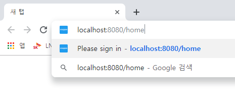
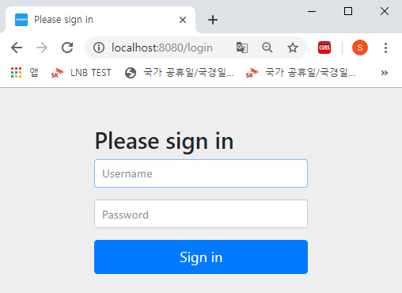
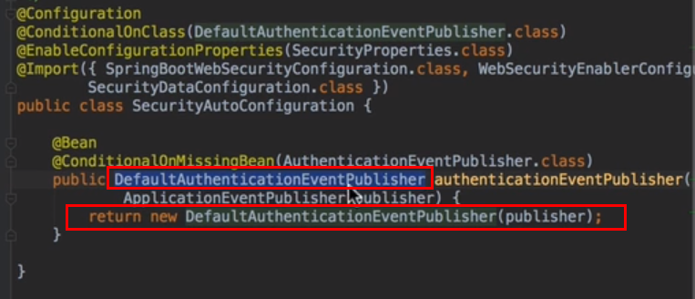
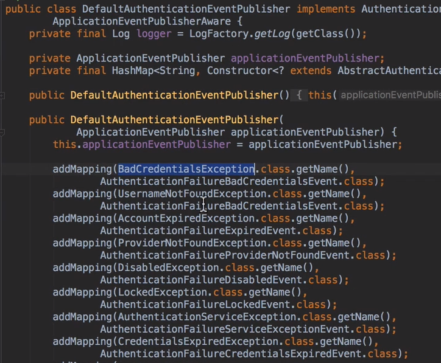
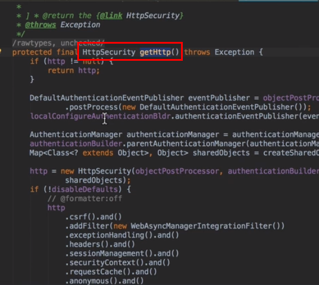
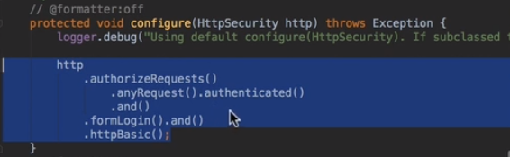

# 강의 노트

## 시큐리티 1부)
### 예제 시나리오
- HELLO 페이지는 누구나가 볼수 있더라도
- MY 페이지는 로그인한 사용자만 볼수 있도록 하는 예제를 만들고자 함.

### 실습 ) 스프링 시큐리티의 기본인증 (Basic Authentication / Form Authentication) 

0. pom.xml에 spring-boot-starter-thymeleaf 추가
1. 홈컨트롤러 작성
2. 테스트 코드 작성
3. 테스트 코드가 성공했으면 pom.xml에 spring-boot-starter-security 추가

unauthorized 에러가 뜰 것이다.  

### 설명 ) 스프링 시큐리티의 기본인증 (Basic Authentication / Form Authentication)

- 이것이 스프링 부트가 제공하는 시큐리티 자동설정 중의 하나이다.  
- 일단 모든 요청이 스프링시큐리티로 인해 인증을 필요하게 된다.
- BASIC AUTHENTICATION && FORM 인증이 둘다 적용된다.
- BASIC인증은 ACCEPT 헤더에 따라 달라진다.
- 401 응답을 받을 때 브라우저는 BASIC AUTHENTICATION 폼을 띄우게 설정되어 있다.
- 다시한번 정리하지만 기본인증(BASIC AUTHENTICATION)은 ACCEPT HEADER에 따라 달라지게 된다.

위에서는 시큐리티의 어떠한 설정도 하지 않았기 때문에 폼인증에 대한 응답을 보내준 것  
accept header에 html을 실어서 보내는것 이것이 브라우저에 내장되어 있는 기본 요청이다.
(11:00 부터 다시 보기)  


### 실습 ) Basic Authentication 

Accept-Header를 다르게 해서 요청을 보내는 TEST 코드를 작성해보자

```java
package com.scrapper.security1.controller;

import org.junit.Test;
import org.junit.runner.RunWith;
import org.springframework.beans.factory.annotation.Autowired;
import org.springframework.boot.test.autoconfigure.web.servlet.WebMvcTest;
import org.springframework.http.MediaType;
import org.springframework.test.context.junit4.SpringRunner;
import org.springframework.test.web.servlet.MockMvc;

import static org.junit.Assert.*;
import static org.springframework.test.web.servlet.request.MockMvcRequestBuilders.get;
import static org.springframework.test.web.servlet.result.MockMvcResultHandlers.print;
import static org.springframework.test.web.servlet.result.MockMvcResultMatchers.status;
import static org.springframework.test.web.servlet.result.MockMvcResultMatchers.view;

/**
 * WebMvcTest 어노테이션
 *  : 슬라이싱 테스트 (웹 계층에 관련된 빈만 등록한다.
 */
@RunWith(SpringRunner.class)
@WebMvcTest(HomeController.class)
public class HomeControllerTest {

    @Autowired
    MockMvc mockMvc;

    @Test
    public void hello() throws Exception{
        mockMvc.perform(get("/hello")
                    .accept(MediaType.TEXT_HTML))
                .andDo(print())
                .andExpect(status().isOk())
                .andExpect(view().name("hello"));
    }

    @Test
    public void my() throws Exception{
        mockMvc.perform(get("/my"))
                .andDo(print())
                .andExpect(status().isOk())
                .andExpect(view().name("my"));
    }

}
```
테스트 결과를 확인해보자  
```text
MockHttpServletResponse:
           Status = 302
    Error message = null
          Headers = [X-Content-Type-Options:"nosniff", X-XSS-Protection:"1; mode=block", Cache-Control:"no-cache, no-store, max-age=0, must-revalidate", Pragma:"no-cache", Expires:"0", X-Frame-Options:"DENY", Location:"http://localhost/login"]
     Content type = null
             Body = 
    Forwarded URL = null
   Redirected URL = http://localhost/login
          Cookies = []
```

테스트 결과를 확인해보면 '/home' 또는 '/hello' 에 대한 컨트롤러의 응답은 302이다. 그리고 location 은 http://localhost/login 로 감싸져서 왔다.  
이 결과는 스프링 시큐리티가 만들어주는 기본적인 로그인 폼으로 이동하도록 하는 응답이 온 것이다.  
3xx는 대부분 리다이렉션 상태코드이고, 응답결과는 3xx로 시작하는 리다이렉션이라고 보면 된다고 한다.

브라우저에서의 동작을 실제로 확인해보면 아래와 같다. hello, home 또는 다른 url(컨트롤러에 GetMapping이 되어 있지 않은 URL)에 대한 요청의 경우 기본적으로 Accept-Header가 html로 되어있기 때문에 자동적으로 login.html로 리다이렉션 된다.

##### /hello URL 요청



##### /home URL 요청




  ##### /login URL 리다이렉션




### 스프링 시큐리티 내에서의 자동 설정 과정

SecurityAutoConfiguration 클래스를 열어보자. SecurityAutoConfiguration 클래스는 Spring Security 가 의존성으로 추가되어 있고SecurityProperties 클래스가 존재할 경우에 적용되는 설정파일이다. SpringBootWebSecurityConfiguration 클래스를 import하고 있다.


기본적으로 추가하고 있는 DefualtAuthenticationEventPublisher의 인스턴스를 Bean으로 생성하고 있는 부분을 살펴보면 이벤트 퍼블리셔가 빈으로 등록되어 있다.



AuthenticationEventPublisher 가 없을 경우에 한해 조건적으로 빈을 생성하고 있다.  

이제 DefaultAuthenticationEventPublisher 클래스 내부를 살펴보자. DefualtAuthenticationEventPublisher 클래스의 생성자 내부에서는 



비번이 틀렸다거나, 유저가 없다거나 account가 expired 되었다거나 등등의 경우에 대해서 이벤트를 발생시키고 우리는 그 이벤트에 대한 핸들러를 등록해서 유저의 상태를 변경하는 등 여러가지 일을 할 수 있다. **이러한 작업은 Spring Boot에만 있는것이 아니고 Spring Security에 이미 존재하는 작업이다.**  

따라서 우리가 스프링 시큐리티를 쓸때 DefaultAuthenticationEventPublisher의 인스턴스를 받어서 Bean으로 등록만 한다면 굳이 스프링 부트의 설정을 안써도 충분히 쉽게 설정할 수 있는 부분이다.

17:00 부터 정리!!!

스프링 시큐리티가 제공해주는 SecurityAutoConfiguration클래스에서 import하고 있는 SpringBootWebSecurityConfiguration을 보면 역시 별다른 설정이 없다.

##### SecurityAutoConfiguration 클래스


##### SpringBootWebSecurityConfiguration 클래스


- WebSecurityConfigureAdapter
- WebSecurityConfigurerAdapter 

가 없으면 @Configuration으로 등록한 아래의 DefaultconfigurerAdapter 를 쓴다는 의미의 코드이다. 이것 역시 오버라이딩 되어 있는 곳에 별다른 설정이 없다.  SecurityProperties 클래스에 설정된 기본 인증 순위와 다르게 설정되어 있는것 외에는 별다른 설정이 없다.

WebSecurityConfigurerAdapter는 스프링 시큐리티를 java기반의 설정을 할때 사용하는 가장 기본적인 클래스이다. 보통 WebSecurityConfigurerAdapter클래스를 상속받아서 만들도록 되어있다.   

즉 WebSecurityConfigurerAdapter클래스를 상속받은 DefaultConfigurerAdapter클래스 내부에 어떠한 구문도 있지 않다는 이야기는 WebSecurityConfigurerAdapter가 사용하고 있는 기본설정을 그대로 사용하고 있다는 의미이다.  


##### WebSecurityConfigurerAdapter 클래스 내부 (1)



위 코드는 WebSecurityConfigurerAdapter 클래스 내부의 코드이다. WebSecurityConfigurerAdapter클래스 내부에는 주요 메서드들이 있는데 이중 중요한 역할을 하는 메서드는 getHttp() 메서드이다. getHttp() 메서드 내의 

- http = new HttpSecurity(...,); http.csrf().and().......;

과 같이 기술된 내용들이 기본 설정에 적용되어 있는 것이다.   

##### WebSecurityConfigurerAdapter 클래스 내부 (2)

아래의 configure 메서드가 핵심이다.



위의 코드를 SpringSecurity가 기본으로 그대로 제공해주는 것이고, 스프링 부트가 아무것도 하지 않았기 때문에 위의 코드가 동작하는 것이다. 

- http.authorizeRequests().anyRequest().authenticated()
  모든 요청에 대해 인증이 필요하다. 는 의미
- .and().formLogin().and().httpBasic()
  form 로그인을 사용하겠다. http 베이직을 사용하겠다. 는 의미

기본설정을 다시 정리해보면 스프링 시큐리티는 뭔가를 해주는 척 하지만 사실은 아무것도 안한 디폴트 설정만을 하고 있다.  

스프링 시큐리티가 뭔가 하는 것 같은 부분이 있는 부분은 사실 UserDetailsServiceAutoConfiguration이다. UserDetailServiceAutoConfiguration에서는 inMemoryUserDetailsManager에서 인메모리에 User 정보를 생성한다 .(자세한 내용 - Role 등등 은 공부를 해야 한다.)


위에서 본 UserDetailsServiceAutoConfiguration클래스, 즉, UserDetailsService에 대한 자동설정이 적용되는 시점은


UserDetailsService클래스가 ConditionalOnMissingBean 상태일 때, 즉, UserDetailsService 타입의 Bean이 등록되어 있지 않을때 UserDetailsServiceAutoConfiguration이 적용된다.


### 정리

- UserDeatilsServiceAutoConfiguration을 사용하고 싶지 않을 경우 
  (UserDetailsService 자동설정을 사용하고 싶지 않을 경우)
  UserDeatilsService를 리턴하는 로직으로 빈으로 등록하면 된다.
- WebSecurityAutoConfiguration을 사용하고 싶지 않을 경우
  (WebSecurity 자동설정을 사용하고 싶지 않ㅇ르 경우)
  WebSecurityConfigurerAdapter 인스턴스를 리턴하는 로직으로 빈으로 등록하면 된다.
  (WebSecurityConfigurerAdapter가 존재하면서 WebSecurityConfigurerAdpater가 빈으로 존재하지 않으면 SpringBootWebSecurityConfiguration이 적용되는 것이기 때문에 WebSecurityConfigurerAdapter를 리턴하는 빈을 등록하면 된다.)
- 참고) 
  보통 @Configuration어노테이션으로 등록하면 이것이 Bean으로 등록하는 것이다. (xml 설정만 접해본지라...)


##### 자동설정을 커스터마이징하는 법

```java
package com.scrapper.security1.config;

import org.springframework.context.annotation.Configuration;
import org.springframework.security.config.annotation.web.configuration.WebSecurityConfigurerAdapter;

/**
 * 커스텀 스프링 부트 시큐리티 설정
 *   : WebSecurityConfigurerAdapter를 extends한 클래스를 선언해 @Configuration으로 등록한 후
 *     아무것도 하지 않을 경우는 기본 인증이 적용된다.
 *     기본 인증이 적용될때 디폴트로 WebSecurityConfigurerAdapter 내에서 수행하는
 *     기본 랜덤 패스워드/계정을 인메모리로 생성해낸다.
 *          ex)
 *          Using generated security password: 73e78e22-300f-4a18-93c3-a34f36adf624
 */
@Configuration
public class WebSecurityConfig extends WebSecurityConfigurerAdapter {
    // DO SOMETHING...
}

```

WebSecurityConfigurerAdapter 클래스를 상속한 WebSecurityConfig클래스를 @Configuration으로 등록하면 WebSecurityAutoConfiguration이 자동적용되지 않는다. 대신 아직 UserDetailsService를 인스턴스로 리턴하는 빈을 등록하지 않았기 때문에 

```text
Using generated security password: dff8aae5-1e15-4714-8a9f-aa71655b7878
```

와 같은 로그는 계속 보인다.  

참고) 

- UserDetailsManager는 
  위와 같은 dff8aae5-1e15-4714-8a9f-aa71655b7878 와 같은 어플리케이션 용 유저 정보를 인메모리 내에 만들어 준다. 
- SpringSecurity를 사용하는 대부분의 서비스들은 보통 그 프로덕트들만의 제품에 맞게 구현된 UserDetailsService를 가지고 있는다.
- 따라서 스프링 부트가 지원하는 시큐리티 관련 기능들은 사실상 실제로 쓸일이 거의 없다고 보면 된다.


### 테스트 코드에서 시큐리티 관련 클래스 깨지는 문제

현재 실습내용에서는 Test코드 결과에서 클래스가 깨져있다는 문구를 볼수 있는데

```xml
        <dependency>
            <groupId>org.springframework.security</groupId>
            <artifactId>spring-security-test</artifactId>
            <version>${spring-security.version}</version>
            <scope>test</scope>
        </dependency>
```

pom.xml에 위와 같이 의존성을 추가해준다.

  

그리고 Test코드에는 아래와 같이 @WithMockUser 어노테이션을 모두 추가해준다.  

```java
package com.scrapper.security1.controller;

import org.junit.Test;
import org.junit.runner.RunWith;
import org.springframework.beans.factory.annotation.Autowired;
import org.springframework.boot.test.autoconfigure.web.servlet.WebMvcTest;
import org.springframework.http.MediaType;
import org.springframework.security.test.context.support.WithMockUser;
import org.springframework.test.context.junit4.SpringRunner;
import org.springframework.test.web.servlet.MockMvc;

import static org.junit.Assert.*;
import static org.springframework.test.web.servlet.request.MockMvcRequestBuilders.get;
import static org.springframework.test.web.servlet.result.MockMvcResultHandlers.print;
import static org.springframework.test.web.servlet.result.MockMvcResultMatchers.status;
import static org.springframework.test.web.servlet.result.MockMvcResultMatchers.view;

/**
 * WebMvcTest 어노테이션
 *  : 슬라이싱 테스트 (웹 계층에 관련된 빈만 등록한다.
 */
@RunWith(SpringRunner.class)
@WebMvcTest(HomeController.class)
public class HomeControllerTest {

    @Autowired
    MockMvc mockMvc;

    @Test
    @WithMockUser
    public void hello() throws Exception{
        mockMvc.perform(get("/hello")
                    .accept(MediaType.TEXT_HTML))
                .andDo(print())
                .andExpect(status().isOk())
                .andExpect(view().name("hello"));
    }

    @Test
    @WithMockUser
    public void my() throws Exception{
        mockMvc.perform(get("/my"))
                .andDo(print())
                .andExpect(status().isOk())
                .andExpect(view().name("my"));
    }

}
```

위와 같이 메서드들마다 @WithMockUser 어노테이션을 추가해줄 수도 있지만 클래스의 바로 위에 선언해 클래스 전역으로 @WitthMockUser 어노테이션을 적용할 수도 있다.

시큐리티 테스트 코드들에 대한 자세한 여러가지 예제는 

<https://docs.spring.io/spring-security/site/docs/current/reference/html/test.html#test-method>

에서 확인 가능하다. (수업에서 제공되는 예제 URL은 변경되어 404가 뜬다.)


