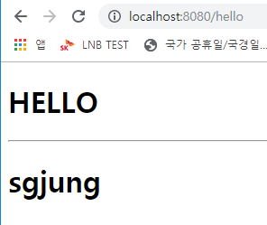

# Thymeleaf 적용하기

### 스프링부트가 자동설정을 지원하는 템플릿엔진들

- FreeMarker
- Groovy
- Thymeleaf
- Mustache


### JSP는??

- 사용을 원한다면 패키징시 WAR로 패키징해야 한다.
- 스프링부트의 자동설정에서 제외되어 있다.
- 임베디드 톰캣 기반으로 독립적인 개발환경에서 빠르고 쉽게 만들고 빠르고 쉽게 배포하는 것이 스프링 부트의 목적이기 때문에 스프링 부트 개발팀에서 지원하고자 하는 목표점과   다른관계로 jsp 지원은 빠져있다.
- war패키징 하더라도 java -jar 옵션으로 임베디드 톰캣을 실행가능하다.
- 다른 톰캣 서블릿 엔진에 war로 배포할수도 있다.
- dependency 트리의 jsp 의존성 문제가 발생한다.


### thymeleaf 공식 레퍼런스

- https://www.thymeleaf.org
- https://www.thymeleaf.org/articles/standarddialect5minutes.html


### 사용해보기

#### 의존성 추가

```xml
        <dependency>
            <groupId>org.springframework.boot</groupId>
            <artifactId>spring-boot-starter-thymeleaf</artifactId>
        </dependency>
```


#### HomeControllerTest.java

HomeControllerTest.java에 아래의 메서드를 추가해주자.

```java
    @Test
    public void helloThymeleafTest() throws Exception{
        mockMvc.perform(get("/hello"))
                .andExpect(status().isOk())
                .andDo(print())
                .andExpect(view().name("hello"))
                .andExpect(model().attribute("name", is("sgjung")))
                .andExpect(content().string(containsString("sgjung")));
    }
```

  

**테스트 결과**

```text
MockHttpServletRequest:
      HTTP Method = GET
      Request URI = /hello
       Parameters = {}
          Headers = []
             Body = <no character encoding set>
    Session Attrs = {}

Handler:
             Type = com.scrapper.security1.controller.HomeController
           Method = public java.lang.String com.scrapper.security1.controller.HomeController.hello(org.springframework.ui.Model)

Async:
    Async started = false
     Async result = null

Resolved Exception:
             Type = null

ModelAndView:
        View name = hello
             View = null
        Attribute = name
            value = sgjung

FlashMap:
       Attributes = null

MockHttpServletResponse:
           Status = 200
    Error message = null
          Headers = [Content-Language:"en", Content-Type:"text/html;charset=UTF-8", X-Content-Type-Options:"nosniff", X-XSS-Protection:"1; mode=block", Cache-Control:"no-cache, no-store, max-age=0, must-revalidate", Pragma:"no-cache", Expires:"0", X-Frame-Options:"DENY"]
     Content type = text/html;charset=UTF-8
             Body = <!DOCTYPE html>
<html lang="en">
<head>
    <meta charset="UTF-8">
    <title>HELLO</title>
</head>
<body>
<h1>HELLO</h1>
</body>
</html>
    Forwarded URL = null
   Redirected URL = null
          Cookies = []
```


**여담**  

MockHttpServletResponse 의 Body 부분에 응답 본문을 확인해볼 수 있다. 이것이 가능한 이유는 thymeleaf가 서블릿의 도움 없이 html을 만들어내기 때문이다. (서블릿 컨테이너에 독립적인 엔진이기 때문)   

jsp를 사용할때는 실제 렌더링 결과물을 보기가 힘들다. 왜냐하면 실제 렌더링을 서블릿엔진이 jsp를 렌더링하기 때문이다.

mockMvc는 실제로 서블릿 컨테이너를 띄우는 것이 아니다. 가짜 서블릿 컨테이너이다. 

  

#### HomeController.java

```java
package com.scrapper.security1.controller;

import org.springframework.stereotype.Controller;
import org.springframework.ui.Model;
import org.springframework.web.bind.annotation.GetMapping;

@Controller
public class HomeController {

    @GetMapping("/hello")
    public String hello(Model model){
        model.addAttribute("name", "sgjung");
        return "hello";
    }
}
```


#### hello.html

thymeleaf를 사용하기 위해서는 html 태그 내에 아래와 같이 xmlns어트리뷰트에 http://thymeleaf.org 를 넣어주어야 한다.

```html
<html lang="en" xmlns:th="http://www.thymeleaf.org">
```


**hello.html 전체내용**  
디렉터리 : src/main/resources/templates/hello.html

```html
<!DOCTYPE html>
<html lang="en" xmlns:th="http://www.thymeleaf.org">
<head>
    <meta charset="UTF-8">
    <title>HELLO</title>
</head>
<body>
<h1>HELLO</h1>
<hr/>
<h1 th:text="${name}"> NAME </h1>
</body>
</html>
```

th:text 에 값을 넣지 않아서 제대로 된 값이 출력되지 않더라도 디폴트 값은 NAME이라는 값이 출력되게 된다.  

#### 출력결과

