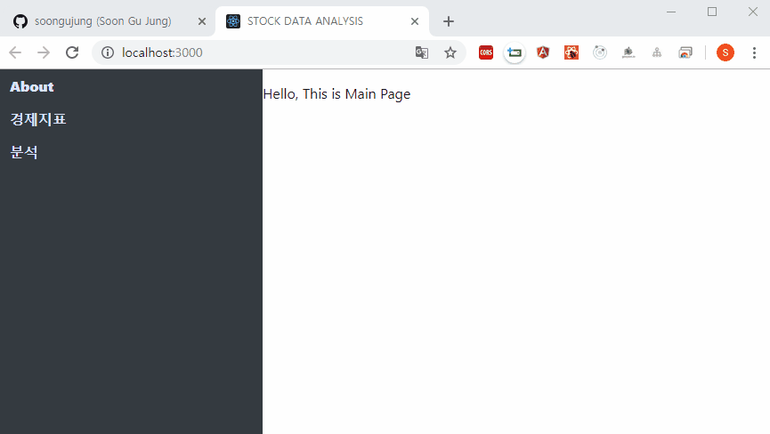
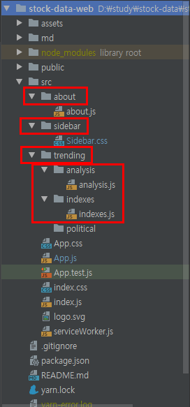
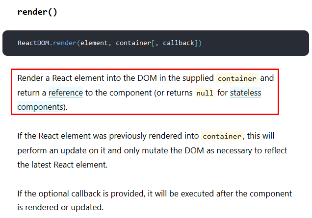

# React Router Simple - how to

react-router-dom을 사용하는 방법을 정리한다.  


## 0.예제 페이지 기획




## 0. 프로젝트 구조

프로젝트 구조는 아래 그림처럼 잡았다.




## 1. 의존성 설치

의존성으로는 react-router-dom이 있다. react-router-dom을 설치하자

```bash
$ yarn add react-router-dom
```


## 2. index.js - BrowserRouter 컴포넌트 추가

**CRA 명령** (yarn create react-app 명령어)를 통해 만든 프로젝트 디렉터리 내의 src 디렉터리에는 index.js가 있다.  

index.js 파일은  

- index.html 내에서 id가  'root'인 요소를 찾아서
- ReactDOM.render() 함수에 ReactDOM.render( arg1, arg2 )의 형식으로 인자로 전달한다.


**ReactDOM.render( arg1, arg2 )**의 인자는

- **arg1**  
  보통 컴포넌트가 들어가는 듯하다. react-router-dom을 사용하지 않는다면 \<App/\> 이 인자로 넘기는 편이다.  
- **arg2**  
  보통 HTML의 요소를 선택해 넘기는 편 인듯 하다.  


```react
import React from 'react';
import ReactDOM from 'react-dom';
import './index.css';
import App from './App';
import * as serviceWorker from './serviceWorker';
import {BrowserRouter} from "react-router-dom";

ReactDOM.render(
    <BrowserRouter>
        <App />
    </BrowserRouter>,
    document.getElementById('root')
);

// If you want your app to work offline and load faster, you can change
// unregister() to register() below. Note this comes with some pitfalls.
// Learn more about service workers: https://bit.ly/CRA-PWA
serviceWorker.unregister();
```

여기서는  

- \<BrowserRouter\> 컴포넌트로 \<App\> 컴포넌트를 감싸서 첫번째 요소로 넘겨주었다.   
- Router를 적용하기 위해서는 \<BrowserRouter\>로 \<App\> 컴포넌트를 감싸주어야 한다.  


라우터를 사용하기 위해서는 최상단의 \<App\> 컴포넌트를 \<BrowserRouter\> 컴포넌트 내에 감싸서 전달해주어야 한다.  


- **ReactDOM.render()**  
    
  더 자세한 내용은  [공식문서](https://reactjs.org/docs/react-dom.html#render)를 참고하자.   

- **BrowserRouter**
  react의 라우터는 BrowserRouter외에도 HashRouter도 있다. 여기서는 그중에서 BrowserRouter를 사용했다.
  자세한 내용은 [공식문서](https://reacttraining.com/react-router/web/guides/primary-components) 를 참고하자.  


## 2. Sidebar - css 컴포넌트 작업 (선택)

sidebar 를 만들어서 

- sidebar는  
  좌측에 고정  
- page-area(sidebar 우측)에는  
  원하는 컨텐츠의 바디를 위치  

로직을 작성할 예정.  


react의 신기한 점은 css도 컴포넌트로 인식된다는 점이다. 여기서는 왼쪽 화면에 메뉴를 가지고 있는 사이드바를 만들 것이다. (css 없이도 원하는 예제를 만들어 확인할 수 있다. )  


**sidebar.css**  

(직접 만들었는데 디자인이 참 구리다. 나중에 색감&디자인을 고려해서 이쁘게 고쳐야 한다.)

```css
/* 왼쪽 사이드바 */
.all{
    display: inline;
}
.sidebar {
    /* div 가로 정렬 */
    display:inline;
    float:left;
    width:300px;

    /* background-color 지정 */
    background-color: #343a40;

    /* 왼쪽 전부 차지하도록 */
    position: fixed;
    overflow: auto;
    height: 100%;
}
.page-area {
    /* 오른쪽 컨텐츠 영역 */
    /* http://alik.info/p/7 */
    /* div 가로 정렬 */
    display:inline;
    position: absolute;
    width:auto;
    margin-left:300px;
    height:100%;
    float: right;
}
.sidebar > ul{
    list-style-type: none;
    margin: 0;
    padding: 0;
}
.sidebar > ul > li a {
    display: block;
    width: 300px;
    color: #000;
    padding: 8px 16px;
    text-decoration: none;
    font-weight: 900;
    color: #dbe4ff;
}
.sidebar > ul> li a:hover{
    background-color: #555;
    color: white;
}
.sidebar > ul > li .active{
    background-color: #4CAF50;
    color: white;
}
```


## 3. App.js - 컴포넌트 라우팅 

App.js 파일을 열어서 href 와 같은 태그에 각 컴포넌트로 이동할수 있도록 해주는 작업을 할 것이다.  


```react
import React, {Component} from 'react';
import logo from './logo.svg';
import './App.css';

import {Sidebar} from './sidebar/Sidebar.css';
import {Route, Link} from 'react-router-dom';
import Indexes from './trending/indexes/indexes';
import Analysis from './trending/analysis/analysis';
import About from './about/about';

class App extends Component {
    render() {
        return (
            <div className="all">
                <div className="sidebar">
                    <ul>
                        <li><Link to="/"> About </Link></li>
                        <li><Link to="/indexes"> 경제지표 </Link></li>
                        <li><Link to="/analysis"> 데이터 분석 </Link></li>
                    </ul>
                </div>
                <div className="page-area">
                    <Route path="/" exact={true} component={About}></Route>
                    <Route path="/indexes" component={Indexes}></Route>
                    <Route path="/analysis" component={Analysis}></Route>
                </div>
            </div>
        );
    }
}

export default App;
```

위 소스에 About, Indexes, Analysis 가 있다. About, Indexes, Analysis는 밑에서 작성하는 컴포넌트 들이다.  


주목해서 봐야 할 부분은 아래의 부분이다.  

```react
                <div className="sidebar">
                    <ul>
                        <li><Link to="/"> About </Link></li>
                        <li><Link to="/indexes"> 경제지표 </Link></li>
                        <li><Link to="/analysis"> 데이터 분석 </Link></li>
                    </ul>
                </div>
                <div className="page-area">
                    <Route path="/" exact={true} component={About}></Route>
                    <Route path="/indexes" component={Indexes}></Route>
                    <Route path="/analysis" component={Analysis}></Route>
                </div>
```


- \<Link to="/blablah"\>\</Link\>  
  어느 URL로 이동할 지를 가리키는(link) 역할을 한다.  

- \<Route path="/blablah" component={BlaBlah}\>\<Route\>  
  URL "/blablah"에 대한 라우팅이다. "/blablah" 링크를 클릭하면 \<Route\> 태그가 위치한 곳의 영역이 BlaBlah컴포넌트의 UI로 대치되게 된다.  

  

exact 프로퍼티는 url이 오직 /blablah일때에만 매칭하겠다는 의미.  

exact를 지정하지 않으면 

- /blablah/:name 과 같은식의 url이 있을경우  
  이 때에도 /blablah에 대한 URL로 라우팅하게 된다.  


## 4. About, Indexes, Analysis 컴포넌트 구현

라우터가 탐색할 컴포넌트를 구현한다.  

#### about.js

```react
import React, {Component} from 'react';

class About extends Component {
    render() {
        return (
            <div>
                <p>Hello, This is Main Page</p>
            </div>
        );
    }
}

export default About;
```

  

#### analysis.js

```react
import React, {Component} from 'react';

class Analysis extends Component {
    render() {
        return (
            <div>
                aaa
            </div>
        );
    }
}

export default Analysis;
```

  

#### indexes.js

```react
import React, {Component} from 'react';

class Indexes extends Component {
    render() {
        return (
            <div>
                <p>HELLO</p>
            </div>
        );
    }
}

export default Indexes;
```

  

## 5. 예제 구동해보기

 yarn start 명령어를 터미널에 입력하면 결과를 확인해볼 수 있다.

```bash
$ yarn start
```

